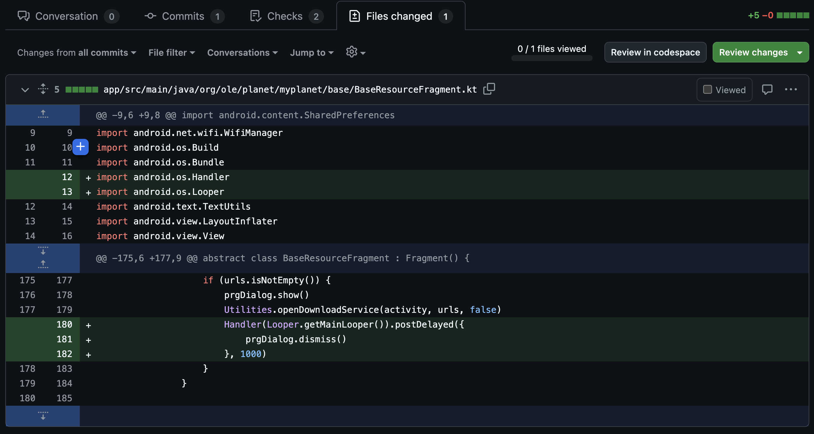
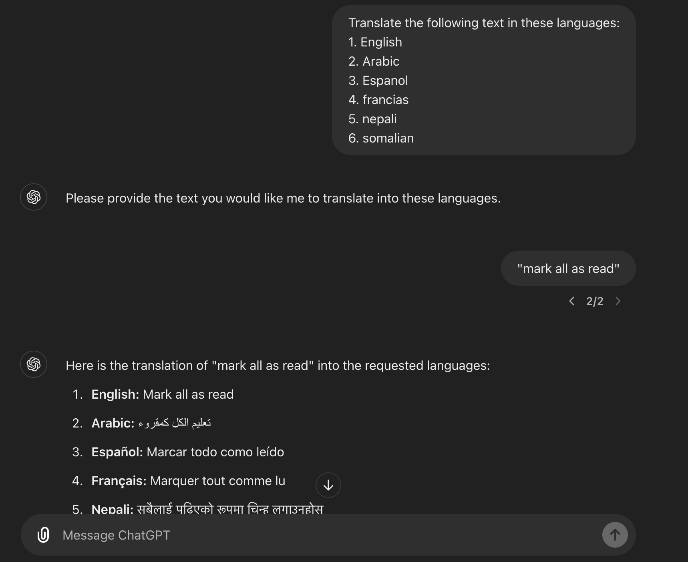

# A Guide to find and translate texts to supported languages

October 21, 2024 • [Kuljeet1998](https://github.com/Kuljeet1998/)

## Introduction

Language translation plays a crucial role in enhancing the user experience on myPlanet, which is used in diverse regions like Mexico, Nepal, Kenya, Ghana, and Somalia. To ensure effective navigation and comprehension, myPlanet supports multiple languages, including English, Arabic, Spanish, French, Nepali, and Somali. Providing complete translation throughout the app allows users to fully engage with its features, enabling them to maximize the app's potential and benefit from its resources.


## Finding non-translated texts: Tips & Tricks

1.  **While testing the app**:
    
    -   When testing the app’s overall flow, ensure you check all tabs and features in different languages, as some may be overlooked.
    -   If you find any untranslated sections, create an issue and resolve it. (Easy 2 points).

2.  **While reviewing PRs**:
    
    - You might encounter untranslated text when reviewing PRs.
    - Expand all the modified files.
    - Pay close attention to any text that remains in English and isn’t referenced from `@strings/...`

    

3.  **While solving a different issue**:
    
    - You might encounter untranslated text when you are solving an issue assigned to you.
    - While working on different issues, you tend to explore the codebase more. This is when you might come across more untranslated texts.
    - Pay close attention to any text that remains in English and isn’t referenced from `@strings/...`
    - If you find it - easy 2 points!


## Leveraging ChatGPT to translate the texts

1.  **Prompt to train texts in the supported languages**:
    
    - Type in:
        ``` 
        Translate the following text in these languages:
            1. English
            2. Arabic
            3. Espanol
            4. francias
            5. nepali
            6. somalian 
        ```
    - Simply enter the text to be translated in double quotes (e.g., "mark all as read").
    - Watch the magic happen!

    

    > [!TIP]
    > Rename this ChatGPT tab for easier access (e.g., !! TRANSLATE !!).

    


## Make the changes in codebase
	
1. **Add the translated texts to respective files**:
	- Copy and paste the translated text into the appropriate XML files.
	- For example, add `<string name="mark_all_as_read">Marcar todo como leído</string>` to `es/strings.xml`.
    - Replace the source text `"Mark all as read"` with `"@string/mark_all_as_read"`.
    - Repeat this process for the XML files of all supported languages.

2. **Build and test**:
	- Build the app.
    - Go to the screen where the changes should appear.
    - Switch between languages to verify that everything works as expected.

3. **Commit, Push, Create PR**:
	- Stage all changes.
    - Commit with an appropriate message.
    - Push to GitHub.
	- Create a pull request.
